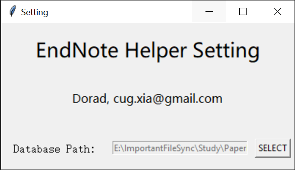
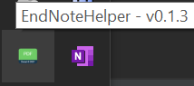
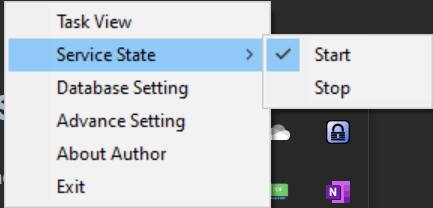
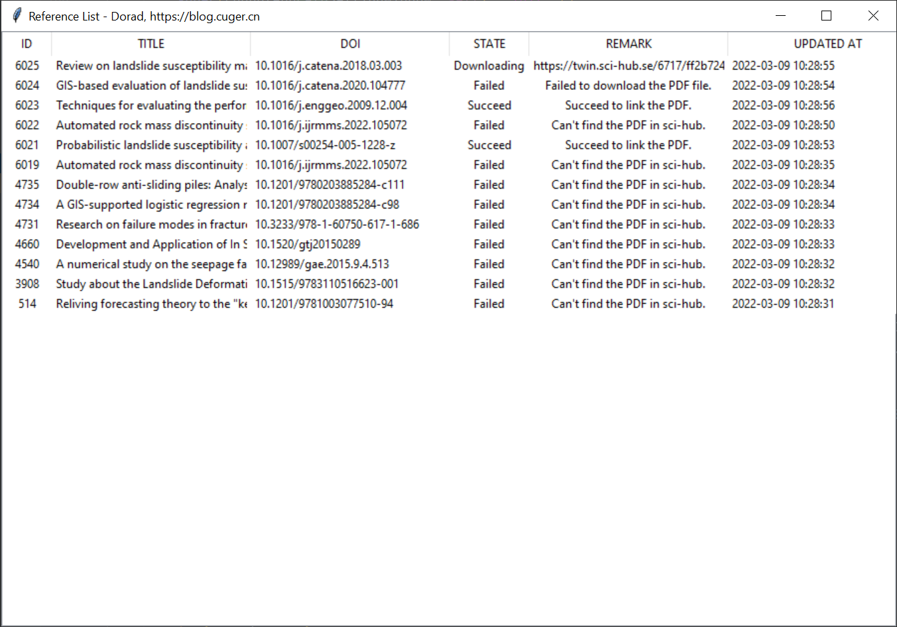

# EndNoteHelper
A tool for automatic download pdf from sci-hub to EndNote X9 and EndNote 20.

# Author
Dorad, cug.xia@gmail.com

# ATTENTION!!!
This is an open-sourced and freeware software.

The author will not be responsible for any results caused by this software. 

Before using this software, please back up your data.

# Tutorial

## Step 1,  Download the latest release version
You can find the latest release version on [Github Release](https://github.com/Doradx/EndnoteHelper//releases/latest).

## Step 2, unzip the downloaded zip file to your software disk.
This is a green software which doesn't need to be installed.
For better management, it is recommended that you can copy it to a disk where you often store your software, such as the D drive.

## Setp 3, Just run the toolbox.
Double click the `EndNoteHelper.exe`, and the setting window will appear, just as shown bellow.

You must select the path of your EndNote database.

## Step 4, Check if the toolbox is running?
If everything is done correctly, a system tray will appear in your taskbar, just like:

Click the right button of your mouse, and check if the service is running?

Just enjoy your self if the service is running now!

## How to find the searching record
The task list will show all the papers which don't have attachment now, and all of their state will be shown in this window.

# Others

## Bug report
If you find any problem with this software, please create new issue in [GitHub Issues](https://github.com/Doradx/EndnoteHelper/issues).

## Donate
Thank you for your donation, it will help the subsequent development of "EndNote Helper".

